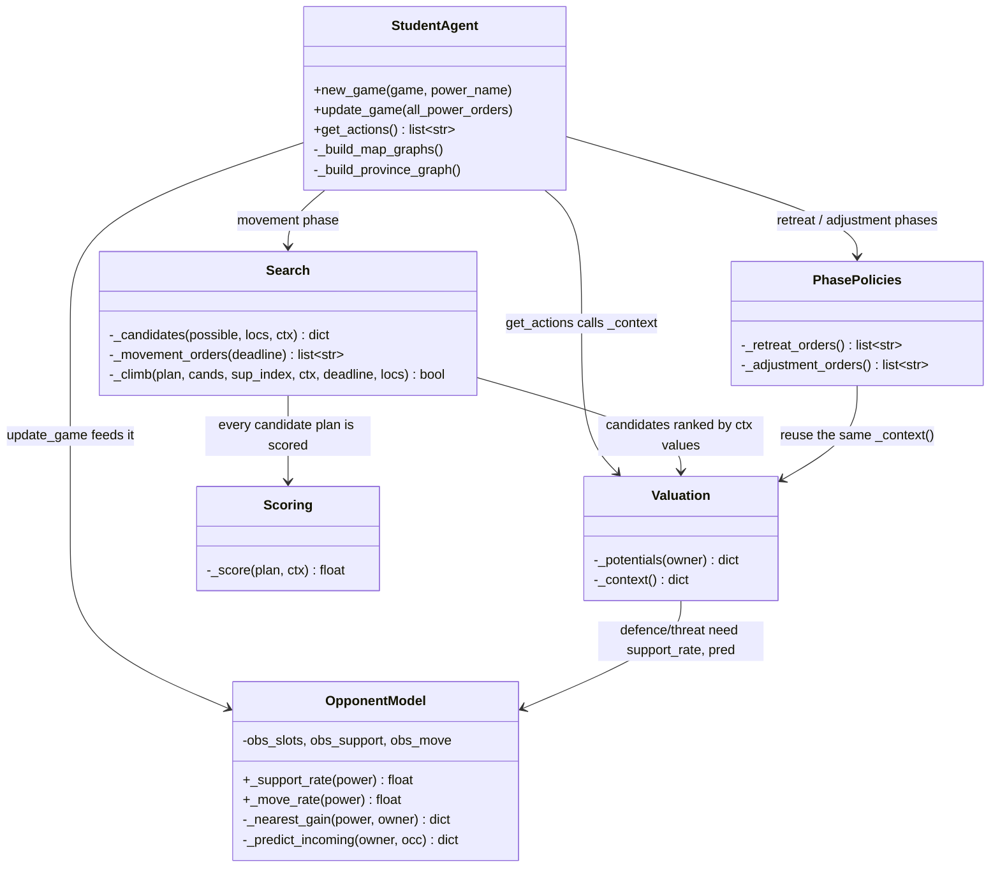
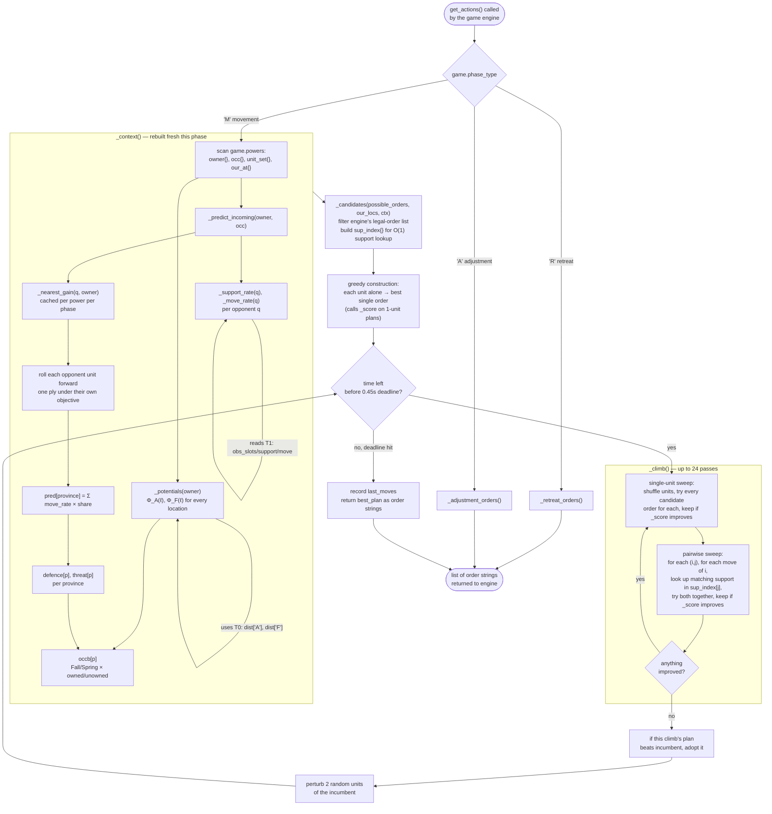
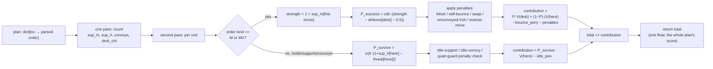
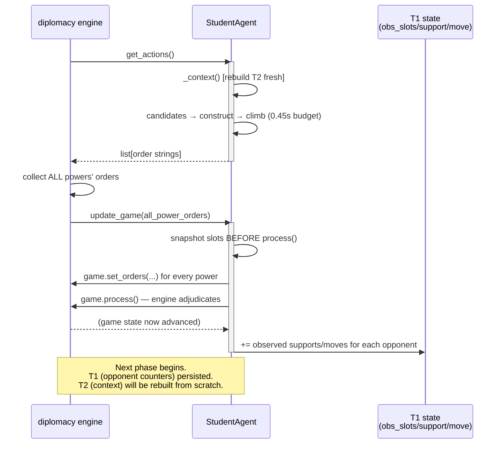
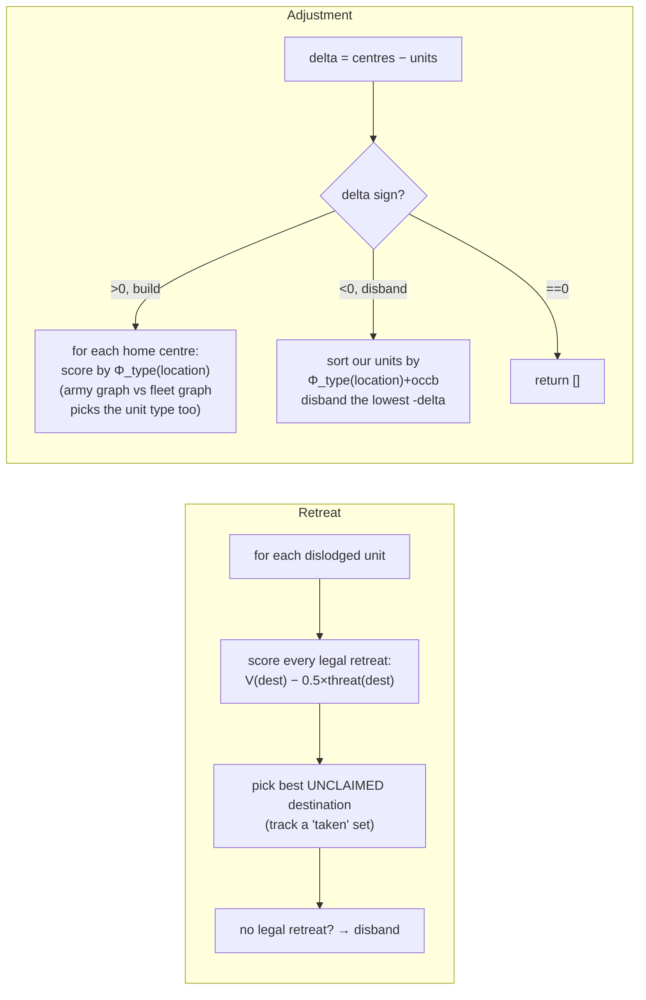
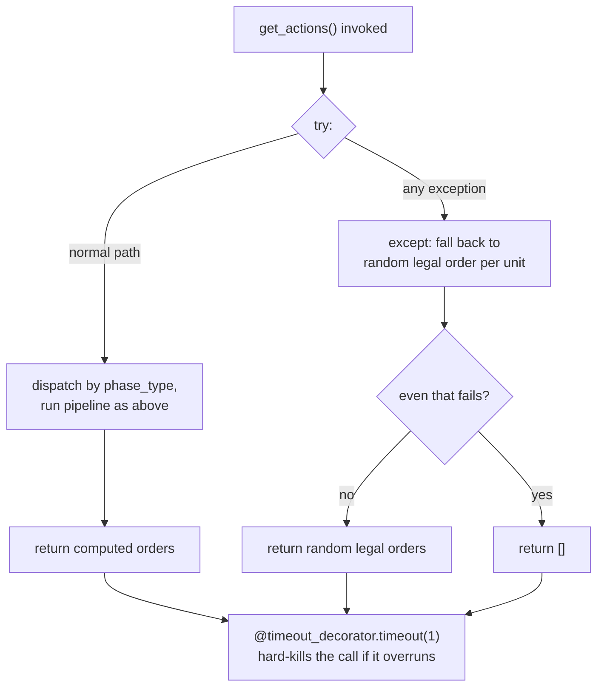

# SYSTEM_DESIGN.md

Architecture and computation flow of `agent_42.py`. Where `IMPLEMENTATION_GUIDE.md` explains *how
to write* each piece and `CLAUDE.md` explains *why* each design decision was made, this document
answers a narrower question: **for a single call to `get_actions()`, what runs, in what order, and
what data does it pass to what.**

---

## 1. Design goals, and how they shaped the architecture

| Goal | Consequence |
|---|---|
| Must never exceed 1 s per call | Search must be **anytime** — interruptible at any point and still return a legal, complete answer |
| Joint order space is too large to search as a tree | Search the **order set directly**, not a game tree; one evaluation function scores a whole plan |
| Combat requires *coordinated* action (§ "why not per-unit scoring") | Evaluation must see the **whole plan at once**, not score units independently |
| Map-invariant computation shouldn't repeat every turn | Split state into **once-per-game** (graphs, distances) vs. **once-per-phase** (context) vs. **once-per-candidate-evaluation** (score) |
| Engine must never receive an illegal order | Candidates are always **filtered from the engine's own legal-order list**, never hand-built |

These five constraints, not any single clever idea, are what produced the three-tier state model in
Section 2 and the four-stage pipeline in Section 4.

---

## 2. State model — what's stored, and for how long

```mermaid
flowchart LR
    subgraph T0["Once per GAME — new_game()"]
        direction TB
        g1["map_graph_army, map_graph_navy<br/>(NetworkX graphs)"]
        g2["padj, pdist<br/>(coast-free province graph)"]
        g3["dist['A'], dist['F']<br/>(all-pairs shortest paths)"]
        g4["nodes_of['A'/'F']<br/>(province → graph nodes)"]
        g5["discount[]<br/>(precomputed γ^d table)"]
        g6["scs<br/>(set of all supply-centre provinces)"]
    end

    subgraph T1["Persists across PHASES — updated in update_game()"]
        direction TB
        p1["obs_slots, obs_support, obs_move<br/>(per-opponent counters)"]
        p2["last_moves<br/>(this turn's (src,dst) set, for oscillation check)"]
    end

    subgraph T2["Rebuilt every MOVEMENT phase — _context()"]
        direction TB
        c1["owner, occ, unit_set, our_at"]
        c2["pot = _potentials()"]
        c3["defence, threat<br/>(uses _predict_incoming)"]
        c4["occb<br/>(occupancy reward table)"]
    end

    subgraph T3["Exists only during ONE get_actions() call"]
        direction TB
        s1["cands<br/>(per-unit legal-order shortlist)"]
        s2["sup_index<br/>(supporter → matching order lookup)"]
        s3["plan<br/>(the candidate order-set being scored/climbed)"]
    end

    T0 -.->|read by| T2
    T1 -.->|read by| T2
    T2 -.->|read by| T3
```

**Why this split matters:** T0 costs ~6 ms and pays for itself over ~30 turns. T1 is cheap to update
(a few counter increments) but expensive to lose — it's the entire memory the opponent model has. T2
is rebuilt fresh every movement phase because ownership, occupancy and threat genuinely change every
turn. T3 is scratch space, discarded the instant `get_actions()` returns.

---

## 3. Component responsibilities

Nothing here is a separate class in the actual code — `agent_42.py` is one flat `StudentAgent` class,
listed this way only to show *conceptual* boundaries. The key dependency to notice: **Scoring depends
on Valuation, Valuation depends on OpponentModel, and Search depends on both** — data flows in one
direction, nothing upstream ever reads from something computed downstream.

---

## 4. The full computation pipeline, one `get_actions()` call

This is the answer to "how is everything calculated" — every arrow below is a real function call or
data dependency in the code, in execution order.

### What `_score(plan, ctx)` does with the T2/T3 data, per candidate plan evaluated above

Every single `_score` call inside construction, the single-unit sweep, and the pairwise sweep runs
this same sequence — it's the innermost, most-called piece of the whole system, so its cost dominates
the time budget:

---

## 5. Sequence across a full game turn (engine ⇄ agent)

This shows how `get_actions()` fits into the larger loop the brief's `game.py` drives, and clarifies
*when* the opponent model actually learns something.

**Key detail worth flagging:** `update_game` counts opponent behaviour using the **slot count taken
before `process()` runs**, but the **orders dict that was already decided before adjudication**. The
opponent model therefore learns from *intent* (what they ordered), not *outcome* (what actually
succeeded) — it never has to guess whether an order was a bluff or a bounce, because it's reading the
order itself, which the engine hands to every power's `update_game` regardless of adjudication
result.

---

## 6. Cost accounting — why the budget holds

| Stage | Frequency | Measured / estimated cost | Why |
|---|---|---|---|
| `_build_map_graphs`, `_build_province_graph` | once per game | ~6 ms | 82 locations, double loop, one-time |
| all-pairs shortest paths (×3 graphs) | once per game | a few ms | NetworkX, small graph |
| `_context()` | once per movement phase | small ms | O(provinces × units), no search inside it |
| `_potentials()` | inside `_context()` | small ms | O(locations × unowned centres × 2 graphs) |
| `_predict_incoming()` | inside `_context()` | small ms | O(opponent units × their degree), cached per-power distance maps |
| `_score()` | called **hundreds of times** per phase | the dominant cost | O(units) per call — this is why it's kept to two flat passes over `plan`, no nested loops over the whole board |
| single-unit sweep | up to 24× per climb | O(units × candidates_per_unit) `_score` calls | bounded by the 34-candidate cap per unit |
| pairwise sweep | up to 24× per climb | O(units² × moves_per_unit) `_score` calls | bounded by `sup_index` giving O(1) lookup instead of O(candidates) |
| **total `get_actions()`** | every movement phase | **measured worst case 0.463 s** | budget is 0.45 s of search + candidate/context overhead; hard limit is 1.0 s |

The two expensive things — `_score` and the pairwise sweep — are both bounded by **our own unit
count**, not the board size or opponent count. This is the direct payoff of the "search the order set,
not a game tree" decision from Section 1: cost scales with $n$ (our units, typically ≤ 15), never with
the opponents' combined branching factor.

---

## 7. Retreat and adjustment phases — same valuation, simpler search

Both reuse `_context()` (so they see the same `pot`, `occb`, `threat` as movement does) but skip the
climb entirely — no coordination is possible in these phase types (each unit's retreat/build/disband
is independent of the others), so there's nothing for the pairwise neighbourhood to find.

---

## 8. Failure containment

The `try/except` is a second, independent line of defence *inside* the 1-second budget — it exists
so that an unexpected engine state (a phase-type this code didn't anticipate, a malformed order
string from `get_all_possible_orders`) degrades to "play something legal" rather than propagating an
exception that would forfeit the turn. The `@timeout_decorator` is the brief's own hard stop; the
internal 0.45 s deadline exists so the agent *chooses* to stop well before that hard stop is ever
tested.

---

## 9. Summary — the one-sentence version of every section above

1. **State** is tiered by how often it changes: graphs once per game, opponent counters persist and
   accumulate, context rebuilt every phase, search scratch discarded every call.
2. **Computation flows one direction**: opponent model → valuation → scoring → search. Nothing
   downstream is read by anything upstream.
3. **`_score()` is the hot path**, called hundreds of times per phase, and its cost is bounded by our
   own unit count — never by the opponents' combined branching factor.
4. **Retreat and adjustment are cheap** because they need no coordination search — the same valuation
   feeds a simple per-unit best-pick instead of a climb.
5. **Two independent safety nets** — an internal try/except and the external hard timeout — guarantee
   the agent never forfeits a turn, regardless of what goes wrong upstream.